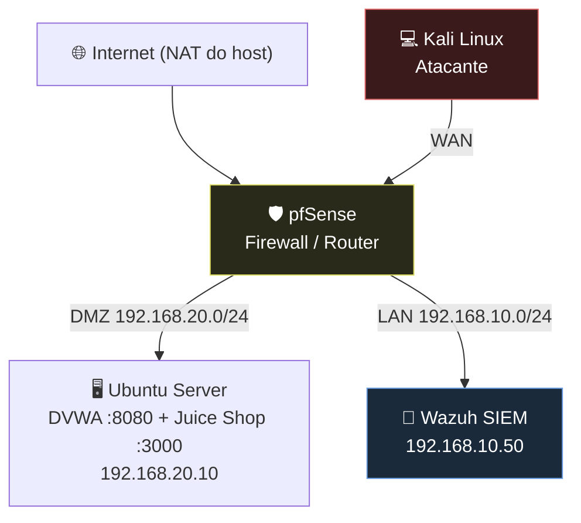

# Topologia do Laboratório

Diagrama da rede (versão em texto/Mermaid). Guarda também aqui o ficheiro `.pkt` do Packet Tracer e uma imagem PNG exportada.

## Regras de firewall (resumo)

| Origem | Destino | Ação |
|---|---|---|
| WAN | DMZ (80/443) | Permitir |
| LAN | Qualquer | Permitir |
| DMZ | LAN | **Bloquear** |
| DMZ | WAN (updates) | Permitir |
